# Attribute

Attribute ist eine Skript-Kategorie. Attribute definieren Objekteigenschaften, auf die andere Skripte ggf. reagieren können. Diese haben eine ähnliche Rolle wie Tags, können jedoch als Skripte mit zusätzlichen Daten geliefert werden.

## BulletAttribute

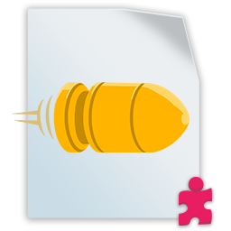

!> Benötigt einen `Collider2D`

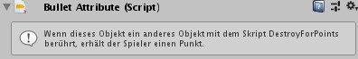

Das `BulletAttribute`-Skript hat keine eigene Funktionalität, enthält jedoch einen Verweis darauf, von welchem Player das Projektil abgefeuert wurde. Diese Nummer (`playerID` im Code) kann 0 (Spieler 1) oder 1 (Spieler 2) sein.

Die ID wird automatisch vom [ObjectShooter](de/components/gameplay#objectshooter)-Skript festgelegt, wenn das Projektil gestartet wird.

> Hinweis: Wenn du aus irgendeinem Grund die `playerID`-Eigenschaft im Inspector festlegen möchten, öffne das `BulletAttribute`-Skript und entferne das Attribut `[HideInInspector]`.
>
> Dies kann hilfreich sein, wenn die Projektile von einem Skript erstellt werden, das kein [ObjectShooter](de/components/gameplay#objectshooter) ist.

## CollectableAttribute

!> Benötigt einen `Collider2D`

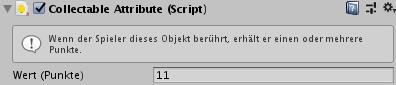

`CollectableAttribute` vergibt einen Punkt an jeden Spieler, der das Objekt berührt. Es erfordert einen `Collider2D` und möglicherweise auch, dass `Ist Auslöser` aktiviert ist, um Kollisionen zu vermeiden.

`Wert (Punkte)` ist die einzige Eigenschaft, die es ermöglicht, jedem Objekt einen anderen Wert zuzuweisen.

> Hinweis: Um die Gesamtpunktzahl auf dem Bildschirm anzuzeigen, muss in der Szene ein UI-Prefab vorhanden sein. Weitere Informationen zum UI-Prefab findest du im Bereich [Erste Schritte](de/getting-started.md).

## DestroyForPointsAttribute

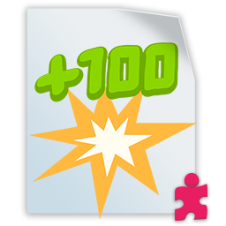

!> Benötigt einen `Collider2D`

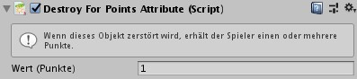

`DestroyForPointsAttribute` eignet sich für Ziele und Feinde in Shooter-Spielen. Es zerstört das GameObject bei einer Kollision mit einem anderen Objekt nur, wenn dieses das [BulletAttribute](#bulletattribute)-Skript hat. Außerdem erhält der Spieler, der ursprünglich auf die Kugel geschossen hat, Punkte.

Weitere Informationen zum Zuweisen von IDs zu Projektilen findest du in [BulletAttribute](#bulletattribute)- und [ObjectShooter](de/components/gameplay#objectshooter)-Skripte.

> Hinweis: Um die Gesamtpunktzahl auf dem Bildschirm anzuzeigen, muss in der Szene ein UI-Prefab vorhanden sein. Weitere Informationen zum UI-Prefab findest du im Bereich [Erste Schritte](de/getting-started.md).

## HealthSystemAttribute

!> Benötigt _nichts_

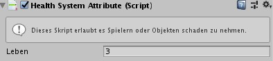

Durch das `HealthSystemAttribute` können Charakteren, Feinden oder Objekten "Leben" hinzugefügt werden. Es erlaubt den Objekten Schaden zu erleiden und möglicherweise aus dem Spiel entfernt zu werden, wenn die Lebenspunkte auf 0 sinken. Falls das Objekt der Spieler selbst ist, kann das für den Spieler das Spielende bedeuten.

Das Skript arbeitet mit dem [ModifyHealthAttribute](#modifyhealthattribute) zusammen, welches auch für Projektile erforderlich ist. Ebenso hat ein Objekt mit [ModifyHealthAttribute](#modifyhealthattribute) keine Auswirkungen auf ein Objekt ohne `HealthSystemAttribute`.

`HealthSystemAttribute` benötigt keinen `Collider2D`, es wird jedoch empfohlen, einen zu haben, wenn du dich auf Kollisionen verlassen willst, um die Lebenspunkte von einem Spieler abzuziehen.

> Hinweis: Um die Gesamtpunktzahl auf dem Bildschirm anzuzeigen, muss in der Szene ein UI-Prefab vorhanden sein. Weitere Informationen zum UI-Prefab findest du im Bereich [Erste Schritte](de/getting-started.md).

## ModifyHealthAttribute

!> Benötigt einen `Collider2D`

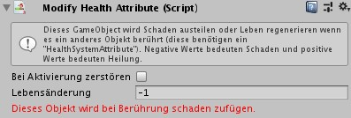

Mit diesem Attribut kann jedes physische Objekt einen Zustand zu jedem Objekt mit einem [HealthSystemAttribute](#healthsystemattribute) subtrahieren oder addieren. Es ist nützlich für Kugeln, Gefahrenzonen usw., aber auch für Dinge, die heilen können, wie Medipacks, Lebensmittel und mehr.

`Bei Aktivierung zerstören` ist eine Eigenschaft, die, wenn sie aktiviert ist, dieses Objekt zerstört, nachdem es seine Effekte erzeugt. Verwende es für Kugeln, Verbrauchsmaterialien und alles, was nur einmal wirken muss.

Die Eigenschaft "Lebensänderung" gibt den von diesem Objekt verursachten Schaden oder die Heilung an. Wenn der Wert negativ ist, wird Schaden zugefügt. Bei positivem Wert hingegen wird das Objekt geheilt. Die letzte Zeile im Inspektor kann rot oder blau werden, je nachdem, in welchem Modus du dich befindest.

## ResourceAttribute

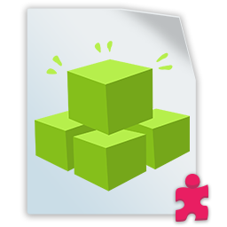

!> Benötigt einen `Collider2D`

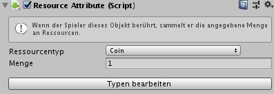

`ResourceAttributes` bietet zusammen mit [ConsumeResourceAction](de/components/actions.md#consumeresourceaction) die Möglichkeit, Ressourcen und ein Inventar für Spiele einzuschließen, die mit Playground erstellt wurden. Durch Berühren eines Objekts mit diesem Skript wird es abgerufen und zu einem auf der Benutzeroberfläche angezeigten Inventar hinzugefügt.

Das Skript benötigt einen `SpriteRenderer`, da das Sprite verwendet wird, um ein Symbol in der unteren linken Ecke neben einer Zahl anzuzeigen, die die Menge der Ressource angibt, über die der Spieler verfügt:

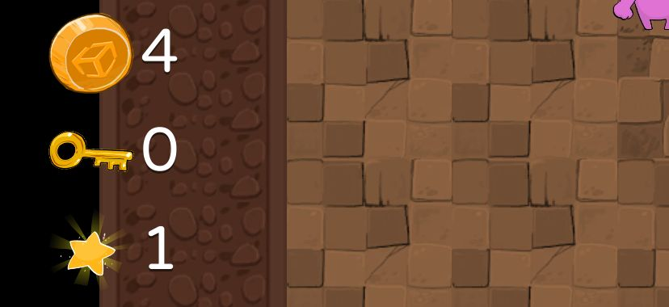

Das Aufnehmen von mehr Ressourcen des gleichen Typs summiert sich zu der Anzahl. Ein [ConsumeResourceAction](de/components/actions.md#consumeresourceaction)-Skript kann sie dann anfordern und verarbeiten. Weitere Informationen findest du in seiner Beschreibung.

Mit Ressourcen kannst du ein "Crafting-System" erstellen (Ressourcen sammeln, dann zum "Bezahlen" um einen neuen Gegenstand zu erhalten) oder einfach ein Tür- / Schlüsselsystem, bei dem jede Tür den richtigen Schlüssel zum Öffnen benötigt.

Welchem Typ diese Ressource angehört, definierst du mit der Eigenschaft `Ressourcentyp` (siehe unten). Optional kannst du eine `Menge` angeben (nützlich für Münzen und Geld).

### Ressourcentypen definieren

Ressourcentypen können durch Klicken auf den Button `Typen bearbeiten` definiert werden. Dadurch wird der Editor auf ein sogenanntes `ScriptableObject` mit dem Namen _InventoryResources_ fokussiert. Auf diesem Objekt sind alle Ressourcentypen im Spiel definiert.

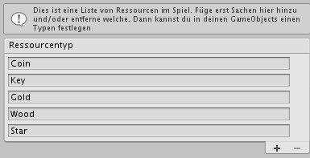

Einige (englische) Typen wurden bereits hinzugefügt, aber du kannst weitere hinzufügen oder entfernen, um ein individuelleres/persönlicheres Gameplay zu erstellen. Stelle nach dem Hinzufügen eines Ressourcentyps sicher, dass du zu dem Objekt mit dem `ResourceAttribute`-Skript zurückkehrst und es zuweist.

> Hinweis: Die Ressourcentypen werden von allen Szenen gemeinsam genutzt. Wenn du also die Basistypen (Coin, Star usw.) entfernst, funktionieren einige Beispielszenen wie _Roguelike_ nicht mehr. Umbenennungen hingegen sind möglich.
>
> Durch Verschieben der Position von ResourceTypen in "InventoryResources" wird auch das System beschädigt.
