# Bedingungen

Bedingungen sind Anweisungen, die dem Wenn-Dann-Sonst-Schema gleichen. Wenn also eine bestimmte Bedingung zutriftt (z.B. die Farbe des Objektes ist grün), dann wird eine bestimmte Aktion ausgeführt (z.B. drehe das Objekt um 90° nach rechts). Wenn die ursprüngliche Bedingung hingegen nicht zutrifft, dann kann eine optionale Aktion für den Sonst-Fall ausgelöst werden (z.B. ändere die Objektfarbe von grün zu rot).

Wenn die Bedingung überprüft wurde, werden die angehängten Aktionen ausgeführt. Weitere Informationen darüber, welche Bedingungen ausgeführt werden können, findest du in [Aktionsskripten](de/components/actions.md). Bedingungsskripte haben ein kleines lila "if" in der oberen linken Ecke ihres Symbols.

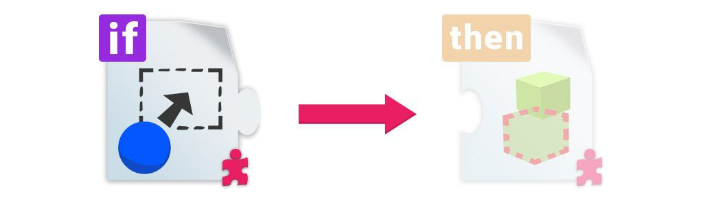

Alle Bedingungsskripte haben einige _gemeinsame Eigenschaften_, die im Folgenden beschrieben werden.

## Allgemeines

### Gameplay Aktionen

Die `Gameplay Aktionen` sind eine Liste von [Aktionsskripten](de/components/actions.md), die ausgeführt werden, wenn die Anforderungen dieses Bedingungsskripte erfüllt sind. In diesem Fall führt Unity die Aktionen in dieser Liste aus, bis eine von ihnen fehlschlägt (nur einige Aktionen können fehlschlagen). Wenn die Aktion nicht fehlschlägt, wird die nächste ausgeführt. Am Ende der Liste werden benutzerdefinierte Aktionen (falls vorhanden, siehe unten) ausgeführt.

Eine leere Liste von Aktionen würde so aussehen:

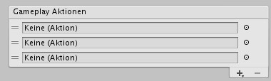

Durch Drücken des Plus-Symbols wird eine Liste der Aktionen angezeigt, die hinzugefügt werden können:

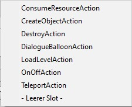

Sie entsprechen genau den Skripte aus der Kategorie [Aktionen](de/components/actions.md). Wenn du eine davon auswählst, wird das Skript als Komponente hinzugefügt und automatisch mit der Liste verbunden.

> **Hinweis** Aktionsskripte müssen in der Liste der `Gameplay Aktionen` sein, damit sie durch die Bedingung ausgelöst werden. Ein einfaches Hinzufügen eines Aktionsskripte zu einem GameObject fügt es nicht zur Liste hinzu.
>
> **Tipp** Am Ende des Dropdown-Menüs kannst du auch einen leeren Slot hinzufügen. Das ist sehr nützlich, um eine Aktion, die auf einem anderen GameObject ist, zu verbinden. Auf diese Weise kannst du deine Logik in Teile aufteilen und die Verwaltung vereinfachen. Um dies in der Praxis zu sehen, öffne das _Roguelike_-Beispielspiel und wähle das Objekt mit dem Namen `InvisibleTrigger` aus. Beachte, dass sich 2 der Aktionen auf separaten Objekten befinden, die diesem übergeordnet sind.

### Eigene Aktionen

Ähnlich wie bei `Gameplay Aktionen` werden `Custom Actions` (= _Eigene Aktionen_) ausgeführt, wenn die Anforderungen des Bedingungsskripte erfüllt sind. `Custom Actions` müssen nicht verwendet werden. Wenn die Option "Eigene Aktionen verwenden" deaktiviert ist, wird keine benutzerdefinierte Aktion ausgeführt.

Wenn du diese Option aktivierst, wird eine Liste von Unity-Ereignissen angezeigt, in der du alle Elemente, für die du normalerweise ein UnityEvent verwendest, miteinander verbinden kannst.

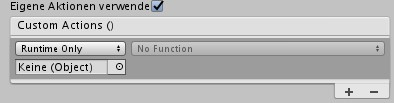

Aus diesem Grund kannst du den Gameplay-Aspekt deines Spiels wirklich erweitern: Wenn du über Programmierkenntnisse verfügst, kannst du ein einfaches Skript schreiben, eine `public` Methode machen und es dann hier einbinden. Auf diese Weise kann dein Skript von einem der Standard-Bedingungsskripte des Playgrounds aufgerufen werden. Dies ist eine großartige Möglichkeit für Lehrer, die Funktionalität des Playgrounds während eines Workshops schnell zu erweitern.

Eine andere Verwendung wäre, hier öffentliche Standard-Playground-Funktionen anzuschließen. Ein gutes Beispiel ist das UI-Skript mit seinen Funktionen `GameWon` und `GameOver`. Indem du eine davon in die Liste `Eigene Aktionen` einbindest, kannst du beispielsweise eine Gewinnbedingung erstellen, wenn ein Objekt mit etwas anderem kollidiert oder in einen Bereich eintritt.

## ConditionArea

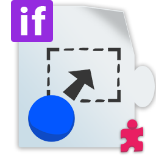

!> Benötigt einen `Collider2D`, der als `Ist Auslöser` markiert ist

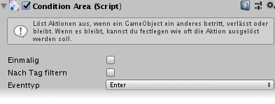

Für `ConditionArea` muss `Collider2D` als Auslöser festgelegt sein. Der `Ereignistyp` bestimmt, wann das Ereignis eintritt: beim Betreten des Bereichs, beim Verlassen des Bereichs oder während des Aufenthalts (wenn du den letzten auswählst, wird die Eigenschaft `Frequenz` angezeigt, um zu bestimmen, wie oft es auftritt).

Da du wahrscheinlich nicht möchtest, dass bestimmte Objekte das Ereignis auslösen, kannst du mit `Nach Tag filtern` die Aktionen nur ausführen, wenn eine bestimmtes Objekte den angegebenen Tag besitzt. Es ist üblich, `Player` zu verwenden, aber du kannst alles verwenden, was du möchtest.

`Einmalig` sorgt dafür, dass die Bedingung nur einmal ausgelöst wird. Bei wiederholtem Eintreten der Bedingung werden die Aktionen nicht ausgelöst.

`Gameplay Aktionen` und `Eigene Aktionen` gelten für alle Bedingungen. Weitere Informationen findest du in den allgemeinen Abschnitten: [Gameplay](#gameplay-aktionen) / [Eigene](#eigene-aktionen).

## ConditionCollision

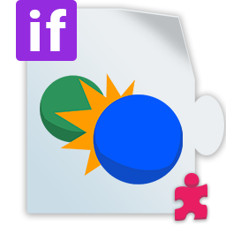

!> Benötigt _nichts_

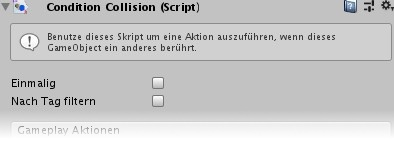

`ConditionCollision` ist eine einfache Bedingung, um etwas zu bewirken, wenn ein Objekt mit einem anderen kollidiert, das dieses Skript enthält. Wie bei anderen Bedingungen kannst du filtern, welcher Objekttyp das Ereignis tatsächlich auslöst, indem du bei `Nach Tag filtern` einen Tag festlegst.

`Einmalig` sorgt dafür, dass die Bedingung nur einmal ausgelöst wird. Bei wiederholtem Eintreten der Bedingung werden die Aktionen nicht ausgelöst.

`Gameplay Aktionen` und `Eigene Aktionen` gelten für alle Bedingungen. Weitere Informationen findest du in den allgemeinen Abschnitten: [Gameplay](#gameplay-aktionen) / [Eigene](#eigene-aktionen).

## ConditionKeyPress

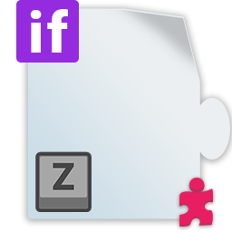

!> Benötigt _nichts_

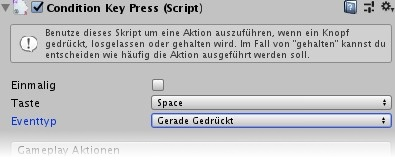

`ConditionKeyPress` ist eine simple Methode um Aktion an einen Tastendruck zu binden. Zusätzlich zur Auswahl der `Taste` kannst du mit `Eventtyp` (`Gerade Gedrückt` (ähnlich `GetKeyDown`), `Losgelassen` (`GetKeyUp`) oder `Gedrückt halten` (`GetKey`)) die Art des zu auslösenden Tastenereignisses auswählen. Wie bei anderen fortlaufenden Aktionen verfügt auch der Modus `Gedrückt halten` über die Eigenschaft `Frequenz`.

`Einmalig` sorgt dafür, dass die Bedingung nur einmal ausgelöst wird. Bei wiederholtem Eintreten der Bedingung werden die Aktionen nicht ausgelöst.

`Gameplay Aktionen` und `Eigene Aktionen` gelten für alle Bedingungen. Weitere Informationen findest du in den allgemeinen Abschnitten: [Gameplay](#gameplay-aktionen) / [Eigene](#eigene-aktionen).

## ConditionRepeat

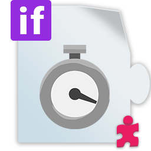

!> Benötigt _nichts_

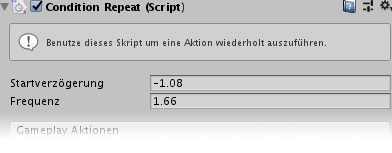

Für einen Vergleich mit dem klassischen "Programmieren" ist `ConditionRepeat` eher ein WHILE-Schleife als eine IF-Bedingung. Die Liste der Aktionen wird wiederholt ohne Benutzereingabe oder Interaktion ausgeführt. Es unterstützt eine `Frequenz` und eine `Startverzögerung`.

`Gameplay Aktionen` und `Eigene Aktionen` gelten für alle Bedingungen. Weitere Informationen findest du in den allgemeinen Abschnitten: [Gameplay](#gameplay-aktionen) / [Eigene](#eigene-aktionen).
