# Bewegung

Diese Kategorie von Skripten befasst sich ausschließlich mit dem Verschieben von GameObjects, unabhängig davon, ob es sich um den Spieler, Gefahren oder andere Objekte handelt. Da Unity Playground auf Physik basiert, benötigen fast alle GameObjects einen `Rigidbody2D`, um Bewegung zu erzeugen, und möglicherweise eine Art von `Collider2D`, wenn du möchtest, dass das Objekt mit anderen interagieren kann.

## AutoMove

!> Benötigt einen `Rigidbody2D`

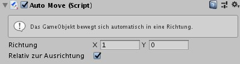

`AutoMove` übt eine kontinuierliche Kraft auf GameObject aus. Nützlich für Dinge wie Raketen, Pfeile und andere selbstbewegende Objekte.

Die Richtung wird durch einen `Vector2` ausgedrückt und enthält die Stärke. Sie kann absolut oder relativ zur Drehung des Objekts sein.

In der Szenenansicht steht ein grüner Pfeil für die Richtung des Drucks, während seine Größe für die Stärke steht.

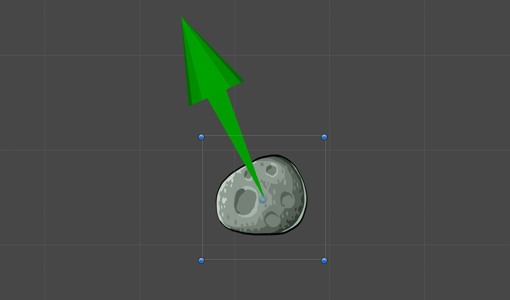

> Wenn du dieses Skript auf einem Prefab verwendest, das mit Hilfe des [ObjectShooter](#objectshooter)-Skripte erstellt wurde, denk daran, dass [ObjectShooter](#objectshooter) beim Schießen bereits eine Kraft auf Objekte anwenden. Im Falle eines nicht selbstbewegenden Objekts (wie eines Katapultsteins) benötigst du keine automatische Bewegung des Projektils.

## AutoRotate

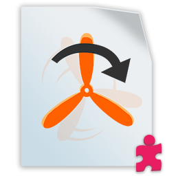

!> Benötigt einen `Rigidbody2D`

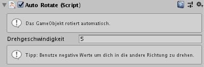

`AutoRotate` wendet eine kontinuierliche Drehung auf ein GameObject auf der Z-Achse an. Es kann verwendet werden, um einem dekorativen Objekt Bewegung hinzuzufügen, aber auch, um in Verbindung mit einem [ConditionCollision](#conditioncollision)-Skript rotierende Hindernisse zu erstellen. Du kannst die Geschwindigkeit festlegen. Wenn du eine negative Geschwindigkeit festlegst, wird das Objekt gegen den Uhrzeigersinn gedreht.

In der Szenenansicht steht ein grüner Pfeil für die Drehrichtung.

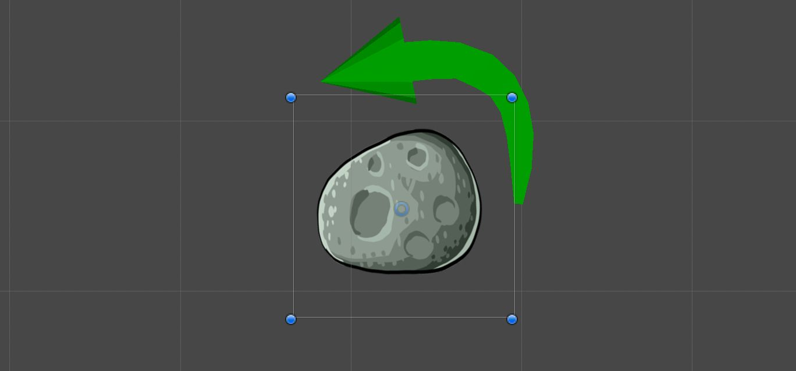

## CameraFollow

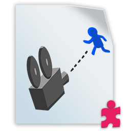

!> Benötigt eine `Kamera`

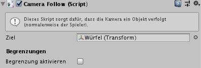

Verwende `CameraFollow` für ein GameObject mit einer Kamera-Komponente. Dies ist nützlich für Action-Adventure-Spiele, bei denen die Kamera auf den Player ausgerichtet ist. Weise einem beweglichen GameObject in der Szene als `Target` zu.

> Füge dieses Skript der Kamera hinzu, nicht dem Objekt, dem du folgst!

Wenn die Eigenschaft `Begrenzung Aktivieren` aktiviert ist, wird die Bewegung der Kamera auf ein Rechteck beschränkt.

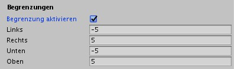

Du kannst die Werte der Begrenzung im Inspektor oder in der Szenenansicht mit dem gelben Rechteck anpassen.

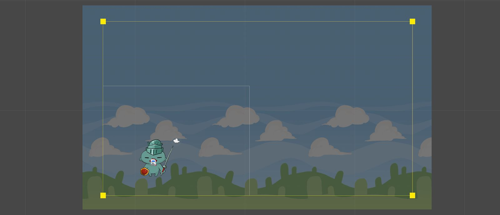

## FollowTarget

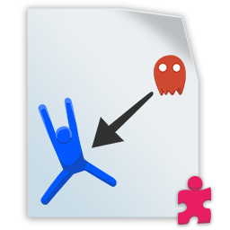

!> Benötigt einen `Rigidbody2D`

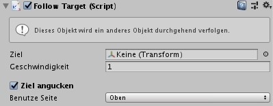

FollowTarget zwingt das GameObject, einem bestimmten Ziel auf unbestimmte Zeit zu folgen.

Mit der Option `Ziel angucken` kannst du auswählen, ob sich das Objekt zum Betrachten des Ziels ausrichtet. Weitere Informationen findest du im [Move](#move)-Skript.

> Tipp: Du kannst dieses Skript einem Feind zuweisen und den Spieler als Ziel verwenden, um eine dauerhafte Bedrohung zu erstellen, oder du kannst eine Reihe von Charakteren erstellen, indem du sie mit einer Reihe von `FollowTarget`-Skripten miteinander verkettest.

## Jump

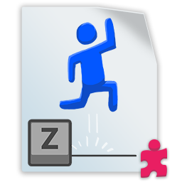

!> Benötigt einen `Rigidbody2D` (und einen `Collider` auf dem es landen kann!)

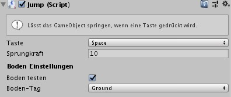

Ein einfaches Skript, das ein Objekt springen lässt, wenn eine bestimmte Taste gedrückt wird. Die Eigenschaft `Taste` ist die Tastaturtaste, die zum Springen verwendet wird (Erklärung [hier](https://docs.unity3d.com/ScriptReference/KeyCode.html) - nur auf Englisch).

Um zu verhindern, dass der Spieler in die Luft springt, aktiviere `Boden testen` und wähle ein Tag aus. Dann musst du alles, was du als Boden betrachten möchten, mit diesem Tag kennzeichnen. Sobald das GameObject mit dem _Boden_ kollidiert, kann es wieder springen.

Wenn `Boden testen` nicht aktiviert ist, kann der Charakter mehrmals in die Luft springen. Das kann nützlich sein, um beispielsweise einen Flügelschlag zu simulieren.

> Tipp: Möglicherweise möchtest du die Eigenschaft `Sprungkraft` zusammen mit der Eigenschaft `Reibung` von `Rigidbody2D` optimieren, um genau die gewünschte Sprungdynamik zu erzielen.

## Move

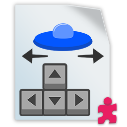

!> Benötigt einen `Rigidbody2D`

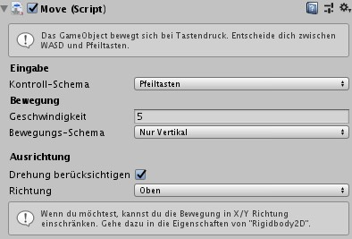

Dieses Skript übt auf zwei Achsen eine konstante Kraft auf das GameObject aus, während entweder die Pfeiltasten oder WASD gedrückt werden.

Die Eigenschaft `Kontroll-Schema` weist den zu verwendenden Steuerungstyp zu. Du kannst zwei dieser Skripte in der Szene haben und jedem Spieler eins zuweisen, um Mehrspielerspiele zu erstellen, die auf derselben Tastatur gespielt werden.

Mit der Eigenschaft `Bewegungs-Schema` kannst du die Bewegung nur auf einer Achse einschränken. Du kannst dir vorstellen, dass es sich auf einem Geländer bewegt, aber du kannst es auch mit anderen Bewegungsskripten kombinieren, um eine verfeinerte Bewegung zu erzielen. Du kannst beispielsweise einen Platformer-Controller erstellen, indem du dieses Skript verwendest und in Verbindung mit einem [Jump](#jump)-Skript auf die horizontale Achse zwingen.

> Denk daran, dass selbst wenn die Kraft, die du auf eine Achse ausüben, nicht die Bewegung des Objekts beeinflusst, kann es immernoch sein, dass dein Objekt von einem anderen getroffen wird und bewegt wird. Dies kann das Gameplay blockieren/beeinflussen. Um dies zu berücksichtigen, aktiviere die Eigenschaft `Position einfrieren` für die entsprechende Achse auf dem `Rigidbody2D`.

Durch die Eigenschaft `Ausrichtung` kannst du steuern, ob sich das Objekt in Bewegungsrichtung drehen soll. Dies ist nützlich für Fahrzeuge (Raumschiffe, Autos, Boote usw.) und im Allgemeinen für Sprites, die von oben gesehen werden.

Wenn es aktiviert ist, kannst du mit der Eigenschaft `Richtung` auswählen, welche Seite als Vorwärtsrichtung verwendet werden soll. Dies hängt davon ab, wie das Sprite gezeichnet wurde.

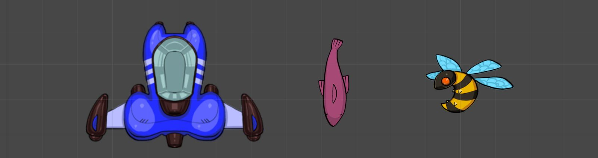

Im obigen Bild würdest du es beispielsweise für das Raumschiff auf `Hoch` und für den Fisch auf `Runter` stellen, während du die Ausrichtung für die Biene auslassen würdest, da sie von der Seite und nicht von oben eingerahmt ist. Rotieren von solchen Sprites würde seltsam aussehen.

## Patrol

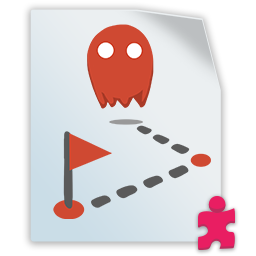

!> Benötigt einen `Rigidbody2D`

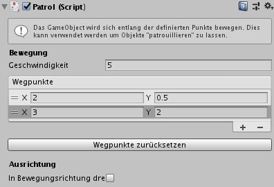

Mit dem Patrol-Skript kannst du ein Objekt entlang eines Pfades aus Wegpunkten bewegen. Die Wegpunkte sind in einer Liste (`Wegpunkte`) organisiert, sodass du sie problemlos hinzufügen, entfernen oder neu anordnen kannst. Der Button `Wegpunkte zurücksetzen` löscht die Liste und fügt nur einen Wegpunkt hinzu.

Das GameObject kehrt zum Startpunkt zurück, sobald alle Wegpunkte erreicht wurden, und startet dann neu.

Wie bei anderen Bewegungsskripte kannst du mit `Ausrichtung` steuern, wie sich deine Sprites beim Bewegen ausrichten. Weitere Informationen findest du bei [Move](#move).

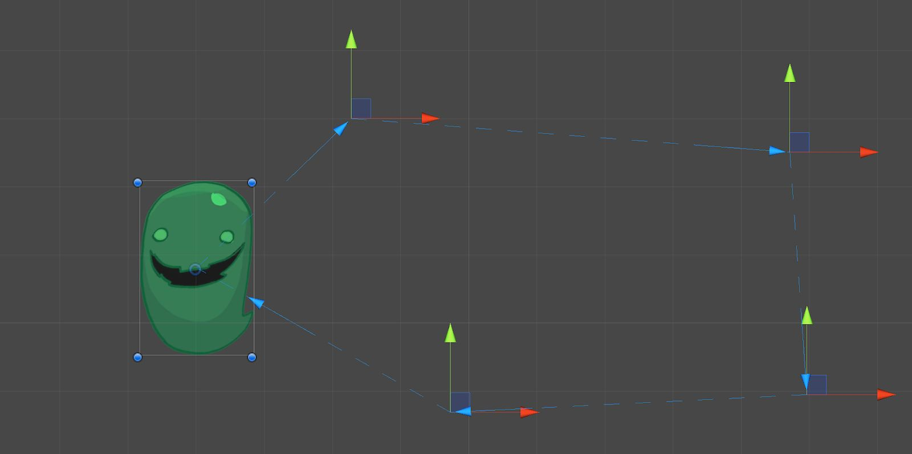

Ein kleiner blauer Pfeil markiert die Bewegungsrichtung.

Wenn du Wegpunkte erstellst, werden diese in der Szenenansicht als 3D-Zeichen dargestellt. Du kannst sie hier oder im Inspektor verschieben, indem du die Positionswerte änderst.

## Push

!> Benötigt einen `Rigidbody2D`

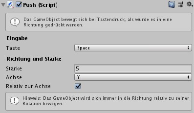

Durch das Skript `Push` wird eine kontinuierliche Kraft in eine Richtung ausgeübt, wenn eine bestimmte Taste auf der Tastatur gedrückt wird. Es ist nützlich, um einen Controller für Fahrzeuge, Raketen usw. zu erstellen. Zusätzlich kannst du ihn in Kombination mit [Rotate](#rotate) verwenden, um das Lenken zu ermöglichen.

In der Szenenansicht wird ein grüner Pfeil angezeigt, der die Richtung und Stärke der Kraft angibt (siehe unten).

Durch Festlegen der Achseneigenschaft kannst du steuern, in welche Richtung gedrückt werden soll (Y bedeutet nach oben, X bedeutet nach rechts). Um einen Druck in die entgegengesetzte Richtung zu erzielen, setze die Eigenschaft `Stärke` einfach auf einen negativen Wert.

In Verbindung mit `Achse` steuert die Eigenschaft `Relativ zur Achse`, ob das Schieben des GameObjects relativ oder absolut oder absolut "rotiert" wird. Du wirst keine Änderung im Gizmo sehen, wenn das Objekt keine Drehung aufweist. Um den Unterschied zu verstehen, schaue dir die Bilder unten an.

Wenn `Relativ zur Achse` **aktiviert** ist, bedeutet dass die Ausrichtung des Objekts dadurch auch beeinflusst wird (im Grunde genommen im lokalen Raum):

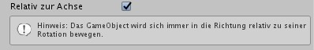
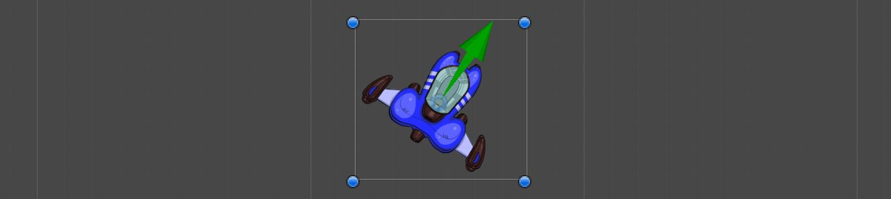

Wenn `Relativ zur Achse` **deaktiviert** ist, ist die Richtung absolut (im Grunde genommen im Weltraum):

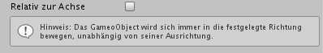
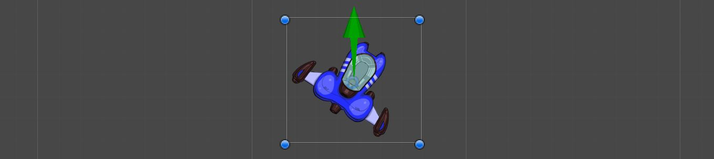

Der Tooltipp unter `Relativ zur Achse` spiegelt die Änderung wider. Meistens solltest du diese eingeschaltet lassen, damit sich das Fahrzeug in Vorwärtsrichtung bewegt.

## Rotate

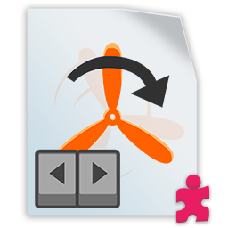

!> Benötigt einen `Rigidbody2D`

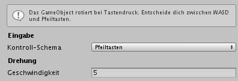

`Rotate` ist ein Skript, mit dem ein Drehmoment angewendet wird, d.h. eine Drehung um die Z-Achse. Wie beim Verschieben wird dies mit den linken / rechten Pfeiltasten oder den AD-Tasten gesteuert. Du kannst es zusammen mit einem [Push](#push)-Skript verwenden, um eine fahrzeugähnliche Steuerung zu erstellen, mit der du in die (vom Fahrzeug angezeigte) Richtung steuern und vorwärts fahren kannst.

> Tipp: Wenn dir der Drehpunkt deines Objekts nicht gefällt, kannst du es einem anderen GameObject zuweisen und dann das [Rotate](#rotate)-Skript auf dieses anwenden. Denk beispielsweise an ein Fahrrad, bei dem der Drehpunkt auf dem Hinterrad liegt. Auf diese Weise hast du viel mehr Kontrolle über den Drehpunkt (Gizmo), ohne es im eigentlichen Sprite-Asset ändern zu müssen.

## Wander

!> Benötigt einen `Rigidbody2D`

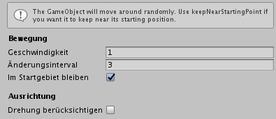

Mit `Wander` bewegt sich das GameObject zufällig in kurzen Schüben. Die Bewegungsgeschwindigkeit wird durch die `Geschwindigkeit` gesteuert, die wie üblich mit der Eigenschaft `Drehungsreibung` im `Rigidbody2D` kombiniert wird, damit es sich richtig anfühlt.

`Änderungsinterval` steuert das Timing (in Sekunden), nach dem das Objekt in eine neue Richtung wandert. Sehr niedrige, bedeutet eine Menge kürzere, plötzliche Bewegungen.

`Im Startgebiet bleiben` bedeutet, dass das GameObject von Zeit zu Zeit eine Überprüfung durchführt. Wenn es zu weit abweicht, bewegt es sich in seiner nächsten Bewegung in Richtung des Startpunkts.

> Hinweis: Wenn du die `Geschwindigkeit` zu hoch einstellst oder nicht genügend `Reibung` auf dem `Rigidbody2D` vorhanden ist, kann das Objekt möglicherweise dennoch sehr weit davonlaufen!

Wie bei anderen Bewegungsskripte kannst du mit `Ausrichtung` steuern, wie du dein Sprite beim Bewegen ausrichten. Informationen zum Verschieben findest du in der Beschreibung vom [Move](#move)-Skript.
