# Aktionen

Aktionen sind Skripte, die nicht alleine funktionieren, sondern von [Bedingungen](de/components/conditions.md) ausgeführt werden müssen. Nur wenn die Bedingung überprüft wurde, wird die Aktion ausgeführt. Du erkennst Aktionsskripte daran, dass sie in der oberen linken Ecke ihres Symbols ein kleines gelbes `then` stehen haben.

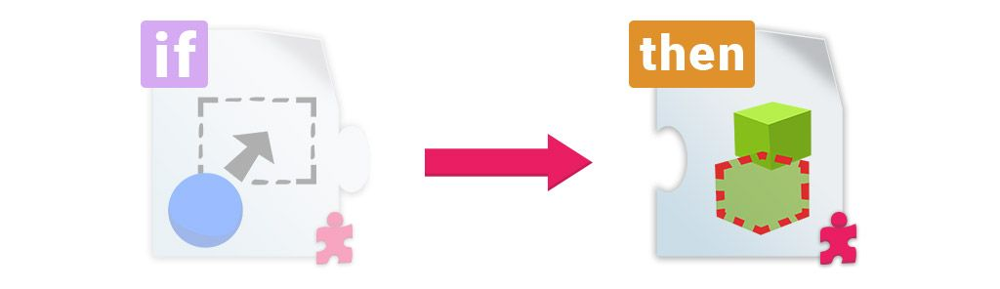

Alle Aktionsskripte haben das Konzept _Erfolg_. Dies bedeutet, dass einige Aktionen fehlschlagen können. Wenn dies der Fall ist, unterbricht die aktuelle Bedingung die Aktionskette und stoppt.

## Allgemeines

### Hinzufügen / Entfernen von Aktionen

Aktionen können wie jede andere reguläre Komponente hinzugefügt werden, aber sie selbst tun nichts - sie müssen immer mit einer Bedingung verbunden sein.

Aus diesem Grund ist es sinnvoll, Aktionen nicht wie gewohnt hinzuzufügen, sondern das Dropdown-Menü von [Bedingungen](de/components/conditions.md) zu verwenden. Dadurch wird die Aktionskomponente hinzugefügt und mit der Liste verbunden. In ähnlicher Weise werden durch das Minus-Symbol sowohl das Element in der Liste als auch die Komponente aus dem GameObject entfernt, sodass es sauber bleibt.

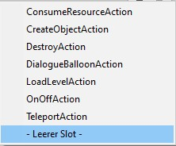

Wenn du eine Aktion auf ein anderes Objekt als das mit der Bedingung packen willst, füge die Aktion als normale Komponente hinzu, gehe zur Liste und verwende die letzte Option "Leerer Slot". Schließlich musst du das GameObject mit der Aktion auf den soeben hinzugefügten Listenplatz ziehen.

Weitere Informationen findest du in [Gameplay Aktionen](de/components/conditions.md#gameplay-aktionen).

## ConsumeResourceAction

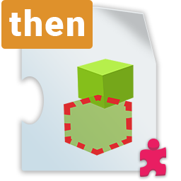

!> Benötigt _nichts_

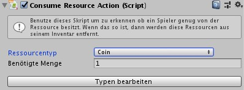

`ConsumeResourceAction` ist eine Aktion, die nur dann ausgeführt wird, wenn eine bestimmte Bedingung überprüft wurde: Der angegebene `Ressourcentyp` muss im Inventar des Spielers in der `Benötigte Menge` vorhanden sein.

Wenn dies zutrifft, wird diese Menge an Ressourcen verbraucht und die folgenden Aktionen werden ausgeführt. Wenn nicht, dann wird keine Ressource verbraucht und die Liste der Aktionen wird angehalten (das bedeutet, die nachfolgenden Aktionen **werden nicht ausgeführt**).

Wie im [ResourceAttribute](de/components/attributes.md#resourceattribute)-Skript kannst du über den Button `Typen bearbeiten` Ressourcentypen hinzufügen/entfernen/umbenennen. Weitere Informationen und eine Übersicht über die Bedeutung von Ressourcen findest du unter [Definieren von Ressourcentypen](de/components/attributes.md#ressourcentypen-definieren).

## CreateObjectAction

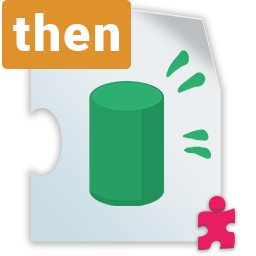

!> Benötigt _nichts_

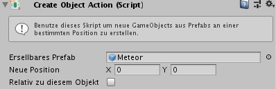

`CreateObjectAction` generiert ein neues Objekt aus einem Prefab (`Erstellbares Prefab`).

Um zu entscheiden, wo das neue Objekt erstellt wird, kannst du `Neue Position` verwenden, welche sich zu Beginn auf (0,0) im X-Y-Koordinatensystem befindet. Wenn `Relativ zu diesem Objekt` aktiviert ist, kann `Neue Position` als _local space_ betrachtet werden.

## DestroyAction

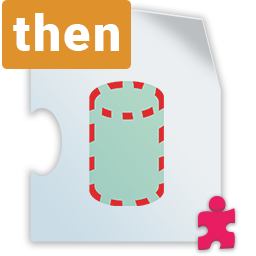

!> Benötigt _nichts_

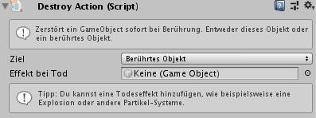

Mit `DestroyAction` können Objekte aus dem Spiel entfernt werden.

Die Eigenschaft `Ziel` kann zwei Werte haben: `Dieses Objekt` und `Berührtes Objekt`. Bei Verwendung des letzteren muss diese Aktion entweder mit einer [ConditionArea](de/components/conditions.md#conditionarea) oder einer [ConditionCollision](de/components/conditions.md#conditioncollision) verbunden sein, sonst schlägt sie fehl.

Du hast die Möglichkeit, einen `Effekt bei Tod` anzugeben. Dies ist ein weiteres Objekt, das generiert wird, wenn das Zielobjekt zerstört wird. Dies kann ein Partikelsystem oder ein anderes Objekt sein (z. B. Trümmer, eine kaputte Version des zu zerstörenden Objekts usw.).

## DialogueBalloonAction

!> Benötigt _nichts_

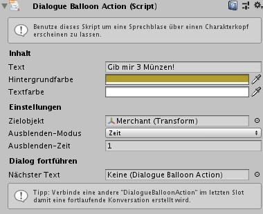

Das `DialogueBalloonAction`-Skript ermöglicht es, einfache Dialoge in das Spiel einzufügen. Du kannst ein Beispiel davon in der `Roguelike`-Beispielszene sehen.

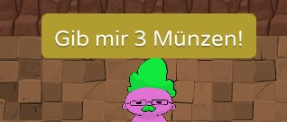

Wenn das `Zielobjekt` festgelegt ist, wird der Text über einem Charakter oder Objekt angezeigt. Ist dies nicht der Fall, wird der Text in der Mitte des Bildschirms angezeigt.

Im `Ausblenden-Modus` sind zwei Werte möglich: Durch `Tastendruck` muss der Benutzer eine Taste drücken (`Taste`), um den Dialog zu entfernen, während der Dialog mit `Zeit` nach den unter `Ausblenden-Zeit` angegebenen Sekunden verschwindet.

Unabhängig davon, wie der Dialog entfernt wird, kannst du eine weitere `DialogueBalloonAction` in der letzten Eigenschaft `Nächster Text` verbinden, um einen fortlaufenden Dialog zu erstellen.

> Tipp: Verwende verkettete `DialogueBalloonAction`-Skripte ohne Ziel und erstelle im `Tastendruck`-`Ausblenden-Modus` kleine Tutorials für dein Spiel.
>
> Durch Verketten mehrerer `DialogueBalloonAction`s und Fokussieren auf verschiedene Charakteren mit der Eigenschaft `Zielobjekt` kannst du Konversationen zwischen zwei oder mehr Charakteren erstellen.

## LoadLevelAction

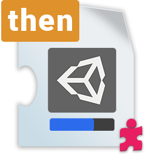

!> Benötigt _nichts_

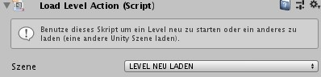

`LoadLevelAction` bietet die Möglichkeit, Unity-Szenen zu laden.

Die Eigenschaft `Szene` zeigt ein Dropdown-Menü mit allen Szenen an, die dem Menü `Build-Einstellungen` hinzugefügt wurden (`Datei` > `Build-Einstellungen`). Zum Laden muss der Liste eine Szene hinzugefügt und aktiviert werden.

Der erste Punkt, `LEVEL NEU LADEN`, lädt nur die aktuelle Szene neu, so dass es nützlich ist, den Status des Spiels nach dem Spielende zurückzusetzen.

## OnOffAction

!> Benötigt _nichts_

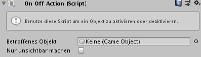

`OnOffAction` ist eine einfache Aktion zum Ein- und Ausschalten eines Objekts, bei der die Eigenschaft `enabled` auf `true` oder `false` gesetzt wird. Du musst das Ziel unter `Betroffenes Objekt` auswählen, damit dies funktioniert.

Wenn ein GameObject `enabled` auf `false` gesetzt hat, wird dieses Objekt nicht mehr dargestellt und kann selber auch nichts mehr machen. Andere Skripte können das Objekt ggf. wieder aktivieren.

Mit `Nur unsichtbar machen` kannst du stattdessen einen `SpriteRenderer` ein- und ausschalten, was bedeutet, dass das Objekt immer noch Teil des Spiels ist, einschließlich etwaiger Kollisionsereignisse.

`OnOffAction` "kippt immer den Schalter" und setzt die Eigenschaft `enabled` auf das Gegenteil. Dies bedeutet, dass bei der zweiten Ausführung der Aktion für dasselbe Objekt der vorherige Status wiederhergestellt wird usw.

> Tipp: Wenn du ein Objekt absolut ein- und ausschalten möchtest (d.h., wenn es zum zweiten Mal keinen Effekt gibt), kannst du ein reguläres UnityEvent verwenden, indem du [Eigene Aktionen](de/components/conditions.md#eigene-aktionen) für die Bedingung aktivierst und `SetActive` auf dem Ziel GameObject auswählst:
> 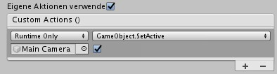

## TeleportAction

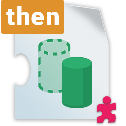

!> Benötigt _nichts_

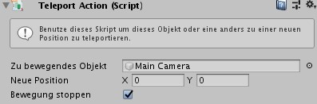

`TeleportAction` verschiebt ein Objekt sofort an einen neuen Ort. Wenn in `Zu bewegendes Objekt` nichts zugewiesen ist, wird dieses Objekt mit dem Skript teleportiert. Die Eigenschaft `Neue Position` ist nicht relativ.

Bei Objekten mit `Rigidbody2D` bedeutet das Aktivieren von `Bewegung stoppen`, dass sie nicht nur teleportiert, sondern auch gestoppt werden, was bedeutet, dass ihre Geschwindigkeit und ihr Drehmoment auf `0` gesetzt werden. Dies ist gut, um den Spielstatus zurückzusetzen (z. B. nach einem Punkt in einem Sportspiel).
