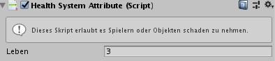

# Einführung


## Willkommen

Egal, ob du ein aufstrebender Entwickler oder ein Mentoren/Lehrer für Spieleentwicklung bist: Willkommen bei Unity!

**Unity Playground** ist ein Framework zum Erstellen von 2D-Spielen auf Physikbasis. Es ist perfekt, um Anfänger Spielentwicklung nahezubringen ohne zu programmieren. Es kann auch verwendet werden, um Game-Design oder Level-Design vorzustellen.

Unity Playground macht Code überflüssig, da es eine Reihe von Komponenten für eine Aufgabe bietet, die einfach zu verwenden und mischen sind. Indem du sie miteinander kombinierst, kannst du physikbasierte 2D-Spiele erstellen, die mehrere Spielgenres umfassen.


_Die Icons einiger Skripte_

Viel Spaß mit Unity-Playground!

## Erste Schritte

Unity Playground soll sehr einfach um rein zu kommen und du kannst dich in weniger als 30 Minuten mit den Grundlagen vertraut machen. Du musst nur die Projektstruktur (siehe [Projektstruktur](#projekt-struktur)) und die Konzepte verstehen, die der Playground implementiert sind ([Allgemeine Konzepte](#allgemeine-konzepte)). Dann solltest du wahrscheinlich einen Blick auf die Skripte werfen, beginnend mit denen, die in der Kategorie [Bewegung](de/components/movement.md) gruppiert sind.

Wenn du weitere Informationen zu einem spezifischen Skript brauchst, gehe zu [Alle Skripte](de/components.md).

### Voraussetzungen

* [Unity](https://unity.com/) 2017.4 oder neuer
* [siehe offizielle Systemanforderungen](https://unity3d.com/unity/system-requirements)

### Unity installieren

> Wenn du dir unsicher beim einrichten bist, lass dir von jemanden helfen der mindestens Englisch versteht und ein Grundverständnis von Computern hat.

1. [Unity Hub](https://store.unity.com/download) herunterladen und installieren
2. Unity 2017.4 oder neuer installieren (im Unity Hub) _Am besten die neuste_

### Deutsche Sprache installieren

Damit Unity auch für dich in Deutsch ist, kannst du die Datei `de.po` (aus dem Ordner `Localization`) in den Unity `Localization` Ordner kopieren. Dieser befindet sich beispielsweise hier:

```path
C:\Program Files\Unity\Hub\Editor\2019.2.0f1\Editor\Data\Localization
```

### Unity Playground installieren

Da wir einen spezielle Version des **Unity Playground**s anbieten können wir diese nicht aus dem, in Unity eingebauten, "Asset Store" installieren.

1. Gehe auf die [Github Seite von NeosIT's Unity Playground](https://github.com/NeosIT/UnityPlayground/) und lade das Projekt als ZIP herunter.

2. Diese .zip-Datei dann an einem beliebigen Ort entpacken (bspw. auf dem Desktop)
3. Jetzt diesen Ordner mit dem Unity Hub öffnen _Add Button drücken_

!> Falls eine Warnung bezüglich einer Unterschiedlichen Unity Version kommt, kann diese ignoriert werden, solange man eine größere Version hat.

Das Ergebnis sollte ähnlich wie dieses aussehen:


Gegebenenfalls muss dann Unity neu gestartet werden.

### Unity auf Deutsch stellen

Nachdem du die zwei vorherigen Schritte erfolgreich ausgeführt hast, musst du Unity noch auf Deutsch stellen (einmalig). Hierzu musst du im Menü `Edit/Preferences` im Abschnitt `Languages` die `Language` auf `Deutsch` stellen:


### Grundlagen

Bevor du Unity Playground verwendest, sollten du dich bereits mit den Kernkonzepten von Unity vertraut gemacht haben. Eine sehr gute Ressource sind die interaktiven Lernprogramme (Englisch), die auf der Seite _Learn_, im Unity Hub finden kannst. Alternativ kannst du auch den Abschnitt Benutzeroberfläche und Grundlagen in den offiziellen Tutorials durchgehen.


## Mach dein erstes Spiel

Ein Spiel mit Unity Playground zu machen ist super einfach! Lass uns ein sehr einfaches Action-Game machen, in dem ein Raumschiff herumfliegt und versucht, einigen Asteroiden auszuweichen.

### 1. Erstellen des Spielers

Ziehe zunächst ein Raumschiffbild aus dem Ordner `/Images/Spaceships` direkt in das Fenster `Hierarchie`. Da es als `Sprite` importiert wurde, wird Unity ein `GameObject` für dich erstellen. Dies wird der Spieler sein. Nennen wir das Objekt also _Raumschiff_ und kennzeichnen dieses GameObject oben im `Inspektor`-Fenster kennzeichne es als `Player`. Verwende dazu das Dropdown-Menü _Tag_.


Lass uns als nächstes die Schiffsbewegung machen. Wir benötigen zwei Komponenten: [Move](de/components/movement.md#move), um die Interaktivität zu gewährleisten, und einen `Rigidbody2D`, um sicherzustellen, dass das Schiff den Gesetzen der Physik folgt. Ziehe ein [Move](de/components/movement.md#move)-Skript aus dem Ordner `/Scripts/Movement` in den Inspektor des Schiffes.

Wenn das Ziehen ein Problem darstellt, kannst du auch das Dropdown-Menü "Komponente hinzufügen" direkt am unteren Rand des Inspektor-Fensters verwenden und dann [Move](de/components/movement.md#move) eingeben. Das Skript sollte als erstes Ergebnis angezeigt werden.


Du wirst feststellen, dass beim Hinzufügen des [Move](de/components/movement.md#move)-Skripte auch eine `Rigidbody2D`-Komponente hinzugefügt wird. Dies liegt daran, dass Move den `Rigidbody2D` benötigt, um zu funktionieren.

> **Szenen Gizmos**
>
> Es kann vorkommen, dass die Symbole für das Playground-Skript sehr groß sind und deine Grafiken verdecken.
> 
>
> In diesem Fall kannst du ihre Größe mithilfe der Dropdown "Gizmos" in der Szenenansicht reduzieren. Ziehe den Slider 3D-Symbole nach links, bis die Symbole die richtige Größe haben.
>
> 

### 2. Anpassen der Physik

Jetzt müssen wir die physikalischen Werte unseres Schiffes einstellen. Bei der `RigidBody2D`-Komponente möchten wir die `Schwerkraft` auf `0` ändern, damit das Schiff nicht herunterfällt. Du kannst auch die bevorzugte Steuerungsmethode (Pfeile oder WASD) auswählen und `Drehung berücksichtigen` aktivieren (wenn das für deine Grafiken sinnvoll ist) und dann die `Richtung` auswählen. Drücke jetzt oben im Editor auf Play (:arrow_forward:), um das Spiel zu testen.

Du wirst wahrscheinlich bemerken, dass das Schiff viel driftet, was die Kontrolle erschwert. Setze die `Reibung` am `Rigidbody2D` auf 10. Wenn du jetzt spielst, wirst du feststellen, dass das Driftverhalten weg ist, aber das Objekt ist auch langsamer, viel langsamer. Dies liegt daran, dass der Kraft, die das Schiff bewegt, nun die Reibung entgegenwirkt.

Daher müssen wir auch die Eigenschaft `Geschwindigkeit` in der [Move](de/components/movement.md#move)-Komponente anpassen. Stell es auf `8` ein und drücke erneut die Play-Taste. Du wirst sehen, dass das Schiff jetzt viel einfacher zu kontrollieren ist. Wir haben gerade unseren ersten Gameplay-Tweak gemacht! Herzlichen Glückwunsch, du bist nun ein Game-Designer!

> **Play-Modus**
>
> Wenn du im "Play-Modus" Komponentenwerte bearbeitest, gehen Ihre Änderungen verloren, sobald das Spiel gestoppt wird. Denk daran, Änderungen nur vorzunehmen, wenn du dich nicht im Play-Modus befinden! Du solltest Änderungen im Play-Modus nur vornehmen, wenn du temporäre Werte testen willst, bei denen du kein Problem hast sie zu verlieren.

### 3. Hinzufügen von Hindernissen und Kollisionen

Wir haben etwas Spielbares, aber es ist nicht wirklich ein Spiel. Fügen wir einige Hindernisse hinzu, durch die das Schiff navigieren muss, indem du ein Asteroiden-Sprite aus dem Ordner `/Images/Asteroids` ziehst. Wie zuvor wird Unity ein GameObject für uns erstellen.

Wir müssen zwei Komponenten hinzufügen: `Rigidbody2D` und `PolygonCollider2D`. Der `PolygonCollider2D` bewirkt, dass dieses Objekt andere Objekte kollidieren (berühren) kann. Wir müssen diese Komponente auch zum Schiff hinzufügen.


Versuche nach dem Hinzufügen von Collidern die Play-Taste zu drücken. Du wirst bemerken, dass das Schiff den Asteroiden jetzt herumschieben kann. Vergiss nicht, die `Schwerkraft` des Asteroiden auf `0` zu setzen, da er ansonsten herunter fällt! Du kannst auch die Parameter des Asteroiden ändern: `Reibung`, `Drehungsreibung` und `Masse`, damit er sich so verhält, wie du es möchtest. Stell die Masse auf `10` ein, damit das Objekt schwerer wird und nicht wegfliegt, wenn es dein Schiff berühren. Ein so großer Asteroid muss sehr schwer sein!

Machen wir diesen Asteroiden jetzt zu einer Bedrohung. Du müsst dem Asteroiden ein [ModifyHealthAttribute](de/components/attributes.md#modifyhealthattribute)-Skript hinzufügen, das sich unter `/Scripts/Attributes` finden lässt.


Dann muss das Schiff in der Lage sein, diesen Schaden zu erkennen. Dazu gibt es ein weiteres Skript namens [HealthSystemAttribute](de/components/attributes.md#healthsystemattribute) (immer noch unter `/Scripts/Attributes`), das wir zum Raumschiff hinzufügen müssen.



Dies gibt dem Spieler nicht nur Gesundheit, sondern ermöglicht es uns, das Start-Leben festzulegen. Mach den Asteroiden zum Prefab und dupliziere ihn (Tastenkürzel: `STRG` + `D` für Windows, `CMD` + `D` für Mac), um ein kleines Asteroidenfeld um das Schiff zu erstellen.

> **Prefabs**
>
> Bevor du den Asteroiden duplizierst, solltest du ihn wahrscheinlich in ein Prefab umwandeln, damit du zu einem späteren Zeitpunkt alle Asteroiden auf einmal bearbeiten kannst.
>
> Wenn du nicht weißt, was ein Prefab ist, und mehr darüber erfahren möchtest, lese im [Handbuch](https://docs.unity3d.com/Manual/Prefabs.html) (Englisch) nach oder schau dir ein kurzes [Video-Tutorial](https://learn.unity.com/tutorial/essential-unity-concepts) (Englisch - Alternativen lassen sich auf YouTube problemlos finden) an.
>
> Prefabs sind ein grundlegendes Konzept in Unity, wenn du ein großes Spiel entwickelst oder im Team arbeitest. Du kannst sie vorerst auch sein lassen und dich auf dein erstes Spiel konzentrieren. Später kannst du immer noch darauf zurückgreifen.

### 4. Hinzufügen einer Benutzeroberfläche

Wir haben bist jetzt kein Feedback, wenn der Spieler getroffen wird. Fügen wir also eine Benutzeroberfläche hinzu, um die Gesundheit des Players zu visualisieren. Zieh das UserInterface-Prefab aus dem Ordner `/Prefabs` in die Szene. Wenn du dir das `Spiel`-Fenster anguckst siehst du Score und Health, welche automatisch eingeblendet werden.

Wenn du das Spiel jetzt spielst, wirst du feststellen, dass das berühren eines Asteroiden einen Punkt Gesundheit abzieht! Und wenn du zu viele Treffer abkriegst, ist das Spiel vorbei!

Nachdem du ein vollständiges Asteroidenfeld hast, ist es an der Zeit, erneut zu testen, ob du tatsächlich darin navigieren kannst, ohne zu viele Treffer zu abzukriegen. Das Spiel muss schwierig sein, aber nicht zu schwierig! Indem du die Asteroiden neu positionierst und das Spiel testest, arbeitest du jetzt im Grunde an der "Game-Balance" und gleichzeitig auch am Level-Design.

### 5. Ein Ziel hinzufügen

Worum geht es also in diesem Spiel? Nehmen wir an, wir möchten, dass das Schiff einige Sterne sammelt, ohne in die Asteroiden zu krachen. Sobald alle Sterne gesammelt sind, ist das Spiel gewonnen.

Füge einen Stern aus dem Ordner `/Images/GameElements` hinzu, indem du ihn in die Szene ziehst. Füge ein [Collectable](de/components/attributes.md#collectableattribute)-Skript aus dem Ordner `/Scripts/Attribute` hinzu. Dies macht den Stern zu einem Sammelobjekt und bringt dem Spieler einen Punkt ein.

Wenn du eine Warnung erhälst, klicke auf `Polygon` und kontrolliere ob das `Ist Auslöser`-Feld des Sterns aktiv ist. Sollte dies der Fall sein kannst du den nächsten Absatz ignorieren, denn ein `PolygonCollider2D` wurde automatisch für dich hinzugefügt.

Aber wie erkennen wir, ob der Stern gesammelt wurde? Wir werden wieder Kollisionen verwenden. Füge ein `PolygonCollider2D` hinzu, aber dieses Mal möchten wir es zu einem Auslöser machen. Aktiviere daher die Eigenschaft `Ist Auslöser`.

> **Auslöser**
>
> Auslöser (eng. Trigger) sind eine besondere Art von Collidern. Sie machen ein Objekt immateriell, sodass es anscheinend keine anderen Objekte berühren kann. Unity erkennt jedoch, wann sich die beiden Objekte berühren, sodass du Aktionen ausführen kannst.
>
> Zum Beispiel sind Auslöser sehr nützlich, um festzustellen, ob ein Spieler das Ende des Levels erreicht hat. Platziere einen direkt vor dem Ausgangs- oder Endpunkt. Wenn der Player diese berührt, wird eine "Du hast gewonnen"-Nachricht angezeigt. Der Spieler sieht nichts, aber der Auslöser gibt dir (dem Entwickler) die Logik, um die Gewinnbedingung zu ermitteln.

### 6. Gewinnbedingung

Wenn du das Spiel jetzt spielst, wirst du feststellen, dass der Stern vom Schiff eingesammelt wird. Zu diesem Zeitpunkt möchtest du den Stern möglicherweise auch zu einem Prefab machen (siehe Hinweis zu Prefabs oben) und ihn dann so oft duplizieren, wie du es für erforderlich hältst. Nehmen wir an, wir haben 5 in der Szene. Jetzt wollen wir sie so verteilen, dass einige leicht zu bekommen sind, während die weiteren schwieriger sind. Auf diese Weise schaffen wir auch eine zunehmende Schwierigkeit für unser kleines Spiel.

Schließlich musst du das UI-GameObject auswählen und im UI-Skript sicherstellen, dass der `Spieltyp` auf `Punkte` gesetzt ist und der `Erforderliche Punkte` 5 ist. Wenn dies nicht mit der Anzahl der Sterne im Spiel übereinstimmt, ist es unmöglich zu gewinnen!

Drück erneut auf "Play" und prüf', ob du das Spiel gewinnen kannst. Wenn du alle 5 Sterne bekommst, solltest du eine Nachricht mit der Aufschrift _Spieler 1 gewinnt!_ Erhalten.

Glückwunsch: Du hast gerade dein erstes Spiel gemacht. Sehr gut! Pass die Einstellungen so lange an, bis du mit den Steuerelementen, dem Schwierigkeitsgrad und dem Level-Layout zufrieden sind.

### Nächste Schritte

Nachdem du dich jetzt mit Unity und dem Unity Playground vertraut gemacht hast, kannst du fortfahren und komplexere Spiele damit erstellen. Als ersten Schritt kannst du einen Blick auf die [allgemeinen Konzepte](#allgemeine-konzepte) von Unity Playground werfen, um sie besser zu verstehen.

Denk daran: Der Unity Playground soll flexibel sein. Überlege dir deine eigenen Spielgenres oder kopiere ein vorhandenes Spiel. Alles ist in erlaubt.

> Hinweis
>
> Wenn du lernst Spiele zu entwickeln, ist es normalerweise eine gute Idee, das Gameplay alter Spiele aus den 80er Jahren (wie Asteroids, Arkanoid, Space Invaders, Frogger und viele andere) zu kopieren, weil sie sehr einfach waren. Wenn du dich verbesserst, kannst du mehr und mehr Details hinzufügen und die Interaktion verfeinern.

Wenn du Inspiration benötigst, öffne den Ordner `Examples` und starte eines der Spiele. Untersuche die GameObjects und sieh dir an, wie wir diese erstellt haben. Versuch dann etwas Ähnliches zu erstellen.

## Allgemeine Konzepte

In diesem Abschnitt wirst du sehr schnell einige grundlegende Konzepte von Unity Playground behandeln. Wenn du dich noch nicht mit Unity oder Unity Playground auskennst, kannst du diese Konzepte benutzen um komplexere Spiele erstellen.

### Info und Warnungen

Alle benutzerdefinierten Skripte in Unity Playground verfügen über ein kleines Infofeld oben, in dem die Funktionsweise des Skripte in wenigen Worten erläutert wird.


In ähnlicher Weise haben viele Skripte mehrere Warnmeldungen (die mit dem gelben Warnschild), die angezeigt werden, wenn beim Setup etwas nicht stimmt. Halte nach diesen Ausschau, sie geben dir möglicherweise einen guten Hinweis darauf, warum ein Skript nicht funktioniert.

### Kollisionen und Auslöser

Fast alle Logikskripte in Unity Playground verwenden Kollisionen, um Gameplay zu erzeugen. Das bedeutet, dass Dinge passieren, wenn sich zwei Objekte mit Collidern berühren oder wenn ein Objekt mit einem Collider in ein anderes Objekt eintritt (das ebenfalls einen Collider hat, aber als Auslöser markiert ist).

So kannst du zum Beispiel Schaden erleiden, der bei Kollisionen mit einem Feind entsteht, ein Level gewinnen, wenn du ein Objekt berührst, Münzen und Power-Ups einsammeln, indem du darauf zu läufts, oder eine Tür öffnen, indem du den Charakter reinläuft - vorausgesetzt, du hast den richtigen Schlüssel!
Ebenso kannst du eine Dialogzeile auslösen, wenn dein Charakter einen Bereich vor einem anderen Charakter betritt (wie in der Roguelike-Beispielszene).

Wenn etwas nicht wie gewünscht funktioniert, frage dich: Habe ich die entsprechenden Collider hinzugefügt?

### Tags

Mithilfe von Tags können wir Objekte in Kategorien unterteilen, sodass Skripte nur dann Aktionen ausführen können, wenn sie die richtigen Objekte berühren. Ohne Tags gibt es keine Möglichkeit, zwischen Objekten zu unterscheiden.

Wie bei Kollisionen hängen viele Skripte von dem Objekt ab, das mit einem Tag versehen werden soll. Wenn du dir nicht sicher bist und dein Skript nicht den Anforderungen entspricht, lies dir die [jeweiligen Skripte](de/components.md) durch, um zu überprüfen, ob du ein wichtiges Tag vergessen hast.

### Eigene Grafiken importieren

Unity Playground enthält viele tolle Sprites zum Spielen, die sich im Ordner `Images` befinden. Es steht dir jedoch frei, alle 2D-Grafiken zu verwenden, die du findest, oder deine eigenen zu erstellen!

Um ein Bild auf in Playground zu verwenden, musst du es nur irgendwo in den Ordner `Assets` ziehen. Das Bild wird als Sprite importiert und kann dann verwendet werden. Durch einfaches Ziehen in die Szene oder in das Hierarchie-Fenster wird ein neues GameObject erstellt, und du kannst es dann im Spiel verwenden.

Denk daran, dass Bilder, die nicht quadratisch sind, Transparenz benötigen, um gut auszusehen. Andernfalls wird ein weißer Hintergrund angezeigt. Gute Formate, die Transparenz ermöglichen, sind `.png` oder `.gif`, während `.jpg` keine Transparenz enthält. Denk auch daran, dass Unity keine animierten GIFs wiedergibt.

## Fortgeschrittene Konzepte

Bist du ein Mentor? Dieser Abschnitt ist ein Muss für dich! Auch für fortgeschrittene Benutzer empfohlen, die den Spielplatz besser verstehen möchten.

### Übersicht

Auf den ersten Blick ist es möglicherweise schwer zu verstehen, wie viele Skripte sich in Playground befinden. Für diesen Fall gibt es die [Übersicht](de/components.md) über alle Skripte. Sie sind in Kategorien (Bewegung, Gameplay usw.) unterteilt.

Es empfiehlt sich diese Seite dann, bei einem Workshop für Anfänger, auszudrucken. Die Seite ist nicht wirklich Drucker freundlich, da sie in Markdown geschrieben ist, damit sie einfacher zu warten und problemlos im Internet angezeigt werden kann. Mit Markdown-To-Word Tools wäre es möglich die Seite zu einem Word Dokument zu machen, anzupassen, als PDF zu exportieren und dann auszudrucken.

### Herausforderungen

Zusätzlich gibt es für die "Schnellen" oder die besonders begabte auch die Möglichkeit [Herausforderungen](de/components) zu erfüllen.

### Projektstruktur

Um das Projekt in einem Workshop zu verwenden, kannst du es entweder kostenlos von [Github](https://github.com/NeosIT/UnityPlayground) herunterladen lassen (siehe [Tutorial](#unity-playground-installieren)) oder, wenn der Internetzugang ein Problem darstellt, die Ordner "Assets" und "ProjectSettings" manuell an die Schüler verteilen.

### Assets-Ordner

`Images` und `Particles` Ordner enthalten grafische Elemente, die als Charaktere, Feinde oder zum Erstellen von Szenen verwendet werden können.

Das Herzstück von Playground, die Skripte, befindet sich im Ordner `Scripts`, der nach Kategorien geordnet ist. Die meisten von ihnen sollten sofort funktionieren, obwohl für einige Objekte eine bestimmte Tag-Kennzeichnung erforderlich ist (weitere Informationen hierzu findest du im Abschnitt [Tags](#tags)).

Es gibt auch einen Ordner mit dem Namen `Examples`, in dem du eine Handvoll kleiner Spiele findest, die bereits erstellt wurden. Du kannst sie als Lernmaterial oder als Ausgangspunkt zum Anpassen verwenden.

Das Projekt enthält einen speziellen Ordner mit dem Namen `_INTERNAL_`. Wie der Name schon sagt, sollte es dieser nicht angefasst werden, es sei denn, du möchtest sich mit dem Innenleben von Playground anlegen. Es enthält Basisskripte, Schriftarten, Gizmos und andere Dinge, die den Schülern eigentlich egal sein sollten. Es muss jedoch im Projekt sein, damit Playground ordnungsgemäß funktioniert.

Dieser Abschnitt befasst sich etwas tiefergehend mit einigen Teilen von Playground, um das Innenleben besser zu verstehen. Empfohlen für Mentoren, die Schüler unterstützen und Probleme in ihren Spielen beheben müssen.

### Tags (intern)

Tags werden von einigen Skripten verwendet, um Objekte zu filtern und zu entscheiden, wann ihre Effekte erzeugt werden sollen. Einige Skripte filtern die `OnCollisionEnter2D` oder `OnTriggerEnter2D` Events von Objekten, während andere (wie [HealthSystemAttribute](de/components/attributes.md#healthsystemattribute)) sich unterschiedlich verhalten, je nachdem, ob das Objekt als `Player` markiert ist oder nicht.

Wenn du den Ordner `ProjectSettings` zu Beginn importierst, sind bereits einige zusätzliche Tags definiert. Speziell:

* `Player` und `Player2` müssen in Playground verwendet werden, damit das UI, Spieler beschädigen, Punkte zu erzielen usw. funktionieren
* Obwohl `Enemy` derzeit in keinem Skript verwendet wird, ist es hilfreich, Feinde zu definieren, auf die die Auswirkungen von Kugeln und Waffen angewendet werden sollen.
* `Bullet` für Geschosse/Projektile.
* `Ground` wird verwendet, um zu überprüfen, was Boden ist, wenn der Spieler springt.

Mit Ausnahme der `Player` Tags kannst du in vielen Skripten definieren, nach welchem Tag gesucht werden soll. Das [Jump](de/components/movement.md#jump)-Skript will zum Beispiel wissen, was als Boden bezeichnet wird, sodass du nicht unbedingt das `Ground` Tag auswählen musst. Diese kommen nur als Empfehlung mit in diesem Projekt.

Du kannst Tags in [Condition](de/components/conditions.md)-Skripten filtern, sodass nur dann etwas passiert, wenn sie mit Objekten kollidieren, die auf eine bestimmte Weise markiert sind usw. Die Tag-Liste wird automatisch aktualisiert und zeigt die gesamte Liste der Tags an, sodass keine Tippfehler möglich sind.

### Benutzeroberfläche (UserInterface)

Die Benutzeroberfläche ist in einem Prefab implementiert, der im `Prefabs` Ordner enthalten ist. Wenn du einfach das `UserInterface` prefab in die Szene ziehst, werden automatisch die Gesundheit und die Punktzahl für Spieler 1 angezeigt. Du kannst jedoch auch festlegen, dass das Spiel für 2 Spieler gilt. Je nach Spielmodus wird dann die Punktzahl oder die Gesundheit für beide Spieler angezeigt.

> Hinweis: Der Text wird erst zu Laufzeit übersetzt.


Das `UserInterface` ermöglicht es auch, die Art des Spiels zwischen Score, Life und Endless zu definieren. Je nach Zustand werden die Bildschirme "Game Over" und "Du gewinnst" angezeigt:

* Wenn der Spieler im Punktemodus die gewählte Punktzahl erreicht, wird der Gewonnen-Bildschirm angezeigt. Wenn zwei Spieler anwesend sind, zeigt die Benutzeroberfläche nur Punktzahlen an und die erste Person, die die Punktzahl erreicht, gewinnt.
* Wenn der Spieler im Lebensmodus 0 Lebenspunkte erreicht, wird "Game Over" angezeigt. Bei zwei Spielern wird der Gesundheitszustand beider Spieler angezeigt. Es gibt keine Möglichkeit zu gewinnen.
* Im Endlos-Modus wird kein "Game Over" des Spiels angezeigt und es gibt keine Möglichkeit, das Spiel zu gewinnen oder zu verlieren.

#### Eigene Spielmodi

Bei Verwendung von [Condition](de/components/conditions.md)-Skripte kannst du die `GameWon`- und `GameOver`-Funktionen des `UIScript` mit einem UnityEvent verbinden. Auf diese Weise kannst du benutzerdefinierte Sieg- und Niederlagebedingungen erstellen, indem du Kollisionen und andere Ereignisse nutzt.

Ebenso kannst du auf die Funktionen `AddOnePoint` und `RemoveOnePoint` aufrufen, um dasselbe mit Punkten zu tun.

## Eigene Inspektoren

Unity Playground verwendet häufig eigene Inspektoren, sowohl für die eigenen Skripte des Playgrounds ([Move](de/components/movement.md#move), [Jump](de/components/movement.md#jump) usw.) als auch für die Standard-Unity-Komponenten (`Transform`, `Collider`, `SpriteRenderer` etc.). Ziel ist es, die Unity-Benutzeroberfläche etwas weniger komplex zu gestalten, um neuen Benutzern Unity so angenehm wie möglich zu gestalten.

Aus diesem Grund wurden auch einige Variablennamen (im Englischen) geändert. Beispielsweise wurde `Drag` im `Rigidbody2D` zu `Friction` umbenannt.

### Playground deaktivieren

Du kannst die benutzerdefinierten Inspektoren in der oberen Menüleiste ein- und ausschalten. Auf diese Weise kannst du visualisieren, was die Playground-Skripte verbergen. Du kannst jederzeit Änderungen vornehmen und anschließend Playground wieder einschalten. Da Playground nur Inspektoren anpasst, funktioniert es weiterhin einwandfrei.


Dieser Trick wird Mentoren empfohlen, die vorübergehend Änderungen an Eigenschaften vornehmen müssen, die von Playground ausgeblendet werden (z. B. Bearbeiten der Form eines Colliders eines beliebigen Typs).

## Tilemaps

In den Grafik-Assets ist eine Reihe von Sprites (Gras, Kopfsteinpflaster, Holz) enthalten, die zum Erstellen der Beispielspiele verwendet wurden und mit denen du mithilfe der Tilemap-Funktion von Unity deine eigenen Level erstellen kannst.

Wenn du mehr über Tilemap erfahren möchtest, findest du eine ausführliche Anleitung im [Unity-Handbuch](https://docs.unity3d.com/Manual/class-Tilemap.html) (Englisch). Die [Learn-Website](https://learn.unity.com) bietet außerdem viele gute Lernprogramme oder du schaust in das Tutorial [Painting a Level section](https://learn.unity.com/tutorial/2d-game-kit-walkthrough) vom 2D Gamekit Video.
